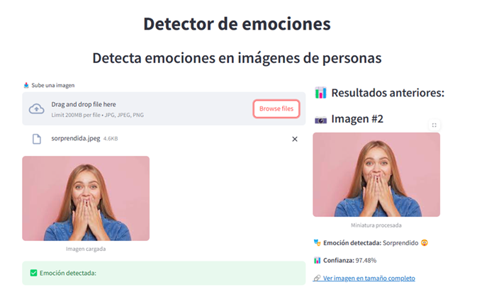
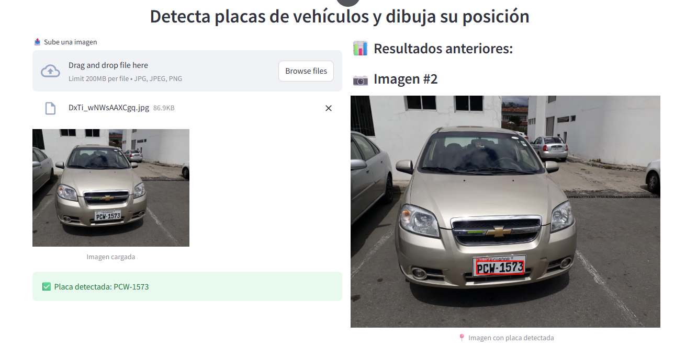

# Detector de Emociones en Imágenes

Esta es una aplicación desarrollada en **Streamlit** que utiliza **AWS Rekognition** para detectar emociones en rostros humanos presentes en imágenes.

<p align="center">
  
</p>


## Funcionalidades

- Subir imágenes de personas en formato `.jpg`, `.jpeg` o `.png`
- Procesamiento en la nube con Rekognition vía API Gateway + Lambda
- Detección de emociones principales
- Visualización del resultado con:
  - Nombre de la emoción (en español)
  - Emoji representativo
  - Porcentaje de confianza
- Historial visual de imágenes procesadas

---

## Detector de Placas de Vehículos (`app2.py`)

Además de detectar emociones, se ha desarrollado una segunda aplicación para detectar **placas vehiculares** y dibujar su posición sobre la imagen. Esta app también está construida con **Streamlit** y consume una API REST desplegada en AWS (Lambda + API Gateway).

<p align="center">
  
</p>

### Funcionalidades:

- Subida de imágenes de vehículos (`.jpg`, `.jpeg`, `.png`)
- Envío de la imagen a una API REST que utiliza un modelo de detección de objetos
- Extracción del número de placa y su localización (bounding box)
- Visualización de la placa detectada sobre la imagen original
- Historial de imágenes procesadas con sus resultados
- Enlace para ver la imagen original

### Ejemplo de respuesta de la API:

```json
{
  "placa_detectada": "PCW-1573",
  "bounding_box": {
    "left": 0.4053,
    "top": 0.7109,
    "width": 0.1537,
    "height": 0.0592
  },
  "imagen_original_url": "https://fotosregs.s3.us-east-1.amazonaws.com/vehiculo-20250806-174234.jpg"
}
```

---

## 🛠️ Requisitos

Este proyecto necesita Python 3.7+ y las siguientes dependencias:

```bash
streamlit
requests
pillow
pandas
```

Instálalas con:

```bash
pip install -r requirements.txt
```

